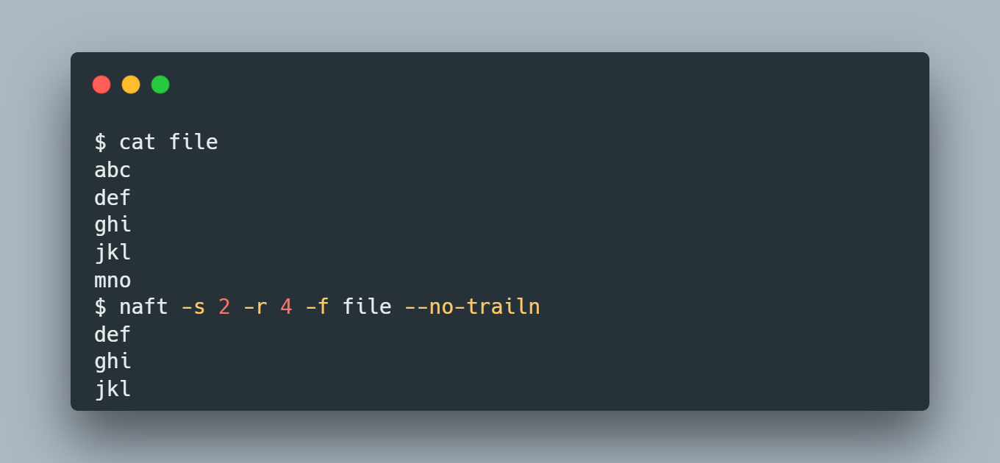

# Naft
A simple program to print lines of files in given range, plus additional features.

## Installation
1. Clone the repository or download the zip.
2. Change directory to the cloned repository directory or to the extracted directory.
3. Run following commands:
4. ``make``
5. ``make install``

## Usage

    

+ For more info, run the following command
  ``naft -h``
